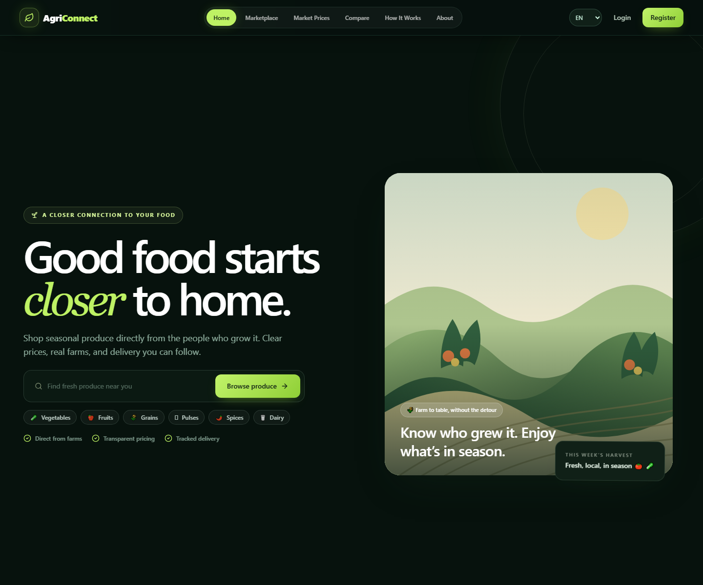

# 🌱 AgriConnect

### Real-Time Farmer-to-Buyer Marketplace and Agricultural Logistics Platform

AgriConnect is a full-stack MERN (MongoDB, Express, React, Node.js) web application that connects **farmers directly with buyers**, removing middlemen and ensuring fair prices. It also includes a complete **logistics module** where delivery partners pick up produce and deliver it with **live, real-time status tracking**.

This project was built as a **TYBScIT CEP (College Final-Year) project** and is designed to be easy to understand, run, and demonstrate.

## Interface Preview



---

## 📑 Table of Contents

1. [Project Overview](#1-project-overview)
2. [Features](#2-features)
3. [Tech Stack](#3-tech-stack)
4. [User Roles](#4-user-roles)
5. [Project Structure](#5-project-structure)
6. [Database Models](#6-database-models)
7. [API Endpoints](#7-api-endpoints)
8. [Real-Time Features (Socket.IO)](#8-real-time-features-socketio)
9. [Prerequisites](#9-prerequisites)
10. [Installation & Setup](#10-installation--setup)
11. [Running the Application](#11-running-the-application)
12. [Demo Accounts](#12-demo-accounts)
13. [Testing the Full Workflow](#13-testing-the-full-workflow)
14. [Environment Variables](#14-environment-variables)
15. [Troubleshooting & FAQ](#15-troubleshooting--faq)
16. [Deployment guide](docs/deployment.md)

---

## 1. Project Overview

In the traditional agricultural supply chain, farmers often sell their produce to middlemen at low prices, while buyers pay high prices. AgriConnect solves this by providing a **direct digital marketplace** where:

- **Farmers** list their produce with price, quantity, and location.
- **Buyers** browse, search, compare prices, and place orders.
- **Delivery Partners** pick up produce and deliver it to buyers.
- **Admins** manage users, products, orders, and assign delivery partners.

Everything happens in **real time** — when a buyer places an order, the farmer instantly receives a notification; when the farmer accepts it, the buyer sees the update immediately; and so on through the entire delivery lifecycle.

> **Note on Market Prices:** The market price data in this project is **demo/academic data** and is clearly labelled as such in the UI. It is **not** live government mandi data.

---

## 2. Features

### 🌾 Farmer Module
- Dashboard with statistics: Total Products, Active Listings, Pending Orders, Completed Orders, Total Sales.
- Full product CRUD (Create, Read, Update, Delete) with image upload.
- Product fields: image, name, category, description, quantity, unit, price, minimum order quantity, harvest date, location, availability.
- Categories: Vegetables, Fruits, Grains, Pulses, Spices, Dairy, Other.
- Order management: Accept → Processing → Ready for Pickup.
- Low-stock alerts.
- Profile management (farm name, farm location, etc.).

### 🛒 Buyer Module
- Browse the marketplace with search, filters (category, price, location), and sorting.
- Detailed product pages with farmer information.
- Shopping cart with quantity controls and over-ordering prevention.
- Checkout with delivery address and payment method.
- Order history and **live order tracking** with a visual timeline and map.
- Price comparison across farmers.

### 🚚 Delivery Partner Module
- Dashboard with assigned, pending pickup, in-transit, and completed deliveries.
- Delivery workflow: Picked Up → In Transit → Delivered.
- Pickup and delivery contact details.

### 🛡️ Admin Module
- Platform statistics and **Recharts** visualizations:
  - Orders over time
  - Sales over time
  - Products by category
  - User distribution
  - Order status distribution
- User management (activate/deactivate/delete).
- Product moderation.
- Order management and **delivery partner assignment**.
- Market price management.

### ⚡ Real-Time Features
- Instant new-order notifications for farmers.
- Live order status updates for buyers, farmers, and delivery partners.
- Notification badge with unread count.
- Toast notifications for every action.

---

## 3. Tech Stack

| Layer | Technology |
|-------|-----------|
| **Frontend** | React.js (Vite), Tailwind CSS, React Router v6, Axios, Recharts, Lucide React, Leaflet + OpenStreetMap |
| **Backend** | Node.js, Express.js, Socket.IO, Multer |
| **Database** | MongoDB with Mongoose ODM |
| **Auth** | JWT (JSON Web Tokens) + bcryptjs password hashing |
| **Language** | JavaScript (ES6+) — no TypeScript, for easy understanding |

---

## 4. User Roles

| Role | Description | Dashboard Route |
|------|-------------|-----------------|
| **Farmer** | Lists and sells produce | `/farmer` |
| **Buyer** | Browses and buys produce | `/buyer` |
| **Delivery** | Picks up and delivers orders | `/delivery` |
| **Admin** | Manages the whole platform | `/admin` |

After login, users are automatically redirected to the dashboard for their role.

---

## 5. Project Structure

```
agriconnect/
├── backend/
│   ├── config/
│   │   ├── constants.js        # Roles, categories, statuses, fees
│   │   └── db.js               # MongoDB connection
│   ├── controllers/            # Business logic for each resource
│   │   ├── authController.js
│   │   ├── userController.js
│   │   ├── productController.js
│   │   ├── cartController.js
│   │   ├── orderController.js
│   │   ├── deliveryController.js
│   │   ├── notificationController.js
│   │   ├── marketPriceController.js
│   │   └── adminController.js
│   ├── middleware/
│   │   ├── authMiddleware.js   # JWT protect + role authorize
│   │   ├── errorMiddleware.js  # 404 + error handler
│   │   └── uploadMiddleware.js # Multer image uploads
│   ├── models/                 # Mongoose schemas
│   │   ├── User.js
│   │   ├── Product.js
│   │   ├── Order.js
│   │   ├── OrderItem.js
│   │   ├── Delivery.js
│   │   ├── Notification.js
│   │   ├── MarketPrice.js
│   │   └── Cart.js
│   ├── routes/                 # Express routers
│   ├── utils/
│   │   ├── generateToken.js
│   │   ├── asyncHandler.js
│   │   ├── socket.js           # Socket.IO helpers
│   │   ├── notify.js           # Notification helper
│   │   ├── geo.js              # Offline geocoder for the map
│   │   ├── seed.js             # Demo data seeder
│   │   └── backfillCoords.js   # One-off coordinate backfill
│   ├── uploads/                # Uploaded product images
│   ├── .env.example
│   ├── package.json
│   └── server.js               # App entry point
│
└── frontend/
    ├── public/
    ├── src/
    │   ├── components/         # Reusable UI components
    │   ├── context/            # Auth, Cart, Toast, Socket providers
    │   ├── layouts/            # Public + Dashboard layouts
    │   ├── pages/              # All pages (public, farmer, buyer, delivery, admin, shared)
    │   ├── services/           # Axios API + Socket.IO clients
    │   ├── utils/              # Helpers + dashboard links
    │   ├── App.jsx             # Routes
    │   ├── main.jsx            # Entry point
    │   └── index.css           # Tailwind + component classes
    ├── .env.example
    ├── index.html
    ├── package.json
    ├── tailwind.config.js
    └── vite.config.js
```

---

## 6. Database Models

| Model | Purpose | Key Fields |
|-------|---------|-----------|
| **User** | All 4 roles | name, email, phone, password (hashed), role, farmName, farmLocation, vehicleType, vehicleNumber, isActive |
| **Product** | Farmer listings | farmer (ref), name, category, description, image, quantity, unit, pricePerUnit, minOrderQuantity, harvestDate, location, isAvailable |
| **Order** | Buyer orders | orderNumber, buyer (ref), farmer (ref), items, totalAmount, deliveryFee, grandTotal, deliveryAddress, status, paymentStatus, deliveryPartner (ref), statusHistory |
| **OrderItem** | Line items | order (ref), product (ref), farmer (ref), name, image, unit, quantity, pricePerUnit, subtotal |
| **Delivery** | Logistics record | order (ref, unique), deliveryPartner (ref), farmer (ref), buyer (ref), pickup/delivery locations, coordinates, status, statusHistory |
| **Notification** | User notifications | user (ref), title, message, type, link, isRead |
| **MarketPrice** | Demo crop prices | crop, category, currentPrice, previousPrice, unit, location, history, isDemo |
| **Cart** | Buyer cart | buyer (ref, unique), items[{ product (ref), quantity }] |

All models use Mongoose validation, references, and timestamps.

---

## 7. API Endpoints

All endpoints are prefixed with `/api`.

### Auth — `/api/auth`
| Method | Endpoint | Access | Description |
|--------|----------|--------|-------------|
| POST | `/register` | Public | Register (farmer/buyer/delivery) |
| POST | `/login` | Public | Login and receive JWT |
| GET | `/me` | Private | Get current user |

### Users — `/api/users`
| Method | Endpoint | Access | Description |
|--------|----------|--------|-------------|
| PUT | `/profile` | Private | Update own profile |
| GET | `/farmer/:id` | Public | Get farmer public profile |
| GET | `/delivery-partners` | Admin | List delivery partners |

### Products — `/api/products`
| Method | Endpoint | Access | Description |
|--------|----------|--------|-------------|
| GET | `/` | Public | List with search/filter/sort/pagination |
| GET | `/names` | Public | Distinct product names (for compare) |
| GET | `/compare?name=` | Public | Compare a crop across farmers |
| GET | `/farmer/my-products` | Farmer | Farmer's own products |
| GET | `/:id` | Public | Single product |
| POST | `/` | Farmer | Create product (multipart) |
| PUT | `/:id` | Farmer | Update product |
| DELETE | `/:id` | Farmer | Delete product |

### Cart — `/api/cart`
| Method | Endpoint | Access | Description |
|--------|----------|--------|-------------|
| GET | `/` | Buyer | Get cart with summary |
| POST | `/` | Buyer | Add item |
| PUT | `/:productId` | Buyer | Update quantity |
| DELETE | `/:productId` | Buyer | Remove item |
| DELETE | `/` | Buyer | Clear cart |

### Orders — `/api/orders`
| Method | Endpoint | Access | Description |
|--------|----------|--------|-------------|
| POST | `/` | Buyer | Place order from cart |
| GET | `/` | Private | List orders (role-aware) |
| GET | `/farmer/stats` | Farmer | Farmer dashboard stats |
| GET | `/buyer/stats` | Buyer | Buyer dashboard stats |
| GET | `/:id` | Private | Single order |
| PUT | `/:id/status` | Farmer/Admin | Update order status |

### Deliveries — `/api/deliveries`
| Method | Endpoint | Access | Description |
|--------|----------|--------|-------------|
| GET | `/my` | Delivery | My deliveries |
| GET | `/` | Admin | All deliveries |
| GET | `/order/:orderId` | Private | Delivery for an order |
| GET | `/stats` | Delivery | Delivery dashboard stats |
| POST | `/assign` | Admin | Assign delivery partner |
| PUT | `/:id/status` | Delivery | Update delivery status |

### Notifications — `/api/notifications`
| Method | Endpoint | Access | Description |
|--------|----------|--------|-------------|
| GET | `/` | Private | List notifications |
| PUT | `/:id/read` | Private | Mark one as read |
| PUT | `/read-all` | Private | Mark all as read |
| DELETE | `/:id` | Private | Delete notification |

### Market Prices — `/api/market-prices`
| Method | Endpoint | Access | Description |
|--------|----------|--------|-------------|
| GET | `/` | Public | List demo market prices |
| GET | `/:id` | Public | Single price |
| POST | `/` | Admin | Create price |
| PUT | `/:id` | Admin | Update price |
| DELETE | `/:id` | Admin | Delete price |

### Admin — `/api/admin`
| Method | Endpoint | Access | Description |
|--------|----------|--------|-------------|
| GET | `/stats` | Admin | Platform statistics |
| GET | `/charts` | Admin | Chart data |
| GET | `/users` | Admin | List users |
| PUT | `/users/:id/toggle` | Admin | Activate/deactivate |
| DELETE | `/users/:id` | Admin | Delete user |

---

## 8. Real-Time Features (Socket.IO)

The backend uses **Socket.IO** with **room-based targeting**. When a user connects, they join a room named after their user id. The server can then emit events to a specific user.

| Event | Sent To | When |
|-------|---------|------|
| `notification:new` | Specific user | Any new notification |
| `order:new` | Farmer | A buyer places an order |
| `order:updated` | Buyer + Farmer + Delivery | Order status changes |
| `delivery:assigned` | Delivery partner | Admin assigns a delivery |
| `delivery:updated` | Buyer + Delivery | Delivery status changes |
| `product:updated` | All | Product stock/availability changes |
| `marketprice:updated` | All | Market price updated |

The frontend listens to these events in `SocketContext.jsx` and updates the notification badge, toasts, and page data **without a page reload**.

---

## 9. Prerequisites

Make sure you have the following installed:

- **Node.js** v18 or higher ([download](https://nodejs.org/))
- **npm** (comes with Node.js)
- **MongoDB** v6 or higher ([download](https://www.mongodb.com/try/download/community)) — either local or MongoDB Atlas (cloud)

To verify:
```bash
node -v
npm -v
mongod --version
```

---

## 10. Installation & Setup

### Step 1 — Clone / extract the project

```bash
cd agriconnect
```

### Step 2 — Start MongoDB

If you installed MongoDB locally, start it:

```bash
# Linux / macOS
mongod --dbpath /path/to/data/db

# Windows (as a service, usually already running)
# Or run: "C:\Program Files\MongoDB\Server\7.0\bin\mongod.exe"
```

> If you prefer **MongoDB Atlas**, create a free cluster and copy the connection string. You'll paste it into the backend `.env` file in Step 4.

### Step 3 — Install backend dependencies

```bash
cd backend
npm install
```

### Step 4 — Configure backend environment

```bash
cp .env.example .env
```

Open `backend/.env` and adjust if needed:

```env
MONGODB_URI=mongodb://127.0.0.1:27017/agriconnect
JWT_SECRET=change_this_to_a_long_random_string
JWT_EXPIRES_IN=7d
PORT=5000
CLIENT_URL=http://localhost:5173
ADMIN_NAME=AgriConnect Admin
ADMIN_EMAIL=admin@agriconnect.com
ADMIN_PHONE=9000000000
ADMIN_PASSWORD=Admin@123
```

> ⚠️ **Port note:** If port `5000` is already in use on your machine (common on macOS/Linux), change `PORT` to `5001` here **and** set `VITE_API_TARGET=http://localhost:5001` in `frontend/.env`.

### Step 5 — Seed the demo data

This creates the admin, 5 farmers, 5 buyers, 3 delivery partners, 24 products, 18 orders, market prices, and notifications.

```bash
npm run seed
```

### Step 6 — Install frontend dependencies

```bash
cd ../frontend
npm install
```

### Step 7 — Configure frontend environment (optional)

```bash
cp .env.example .env
```

The default `VITE_API_TARGET=http://localhost:5000` matches the backend default. Change it only if your backend runs on a different port.

---

## 11. Running the Application

You need **two terminals** running at the same time.

### Terminal 1 — Backend

```bash
cd backend
npm run dev
```

You should see:
```
🚀 AgriConnect backend running on http://localhost:5000
🌐 CORS allowed origin: http://localhost:5173
✅ MongoDB connected: 127.0.0.1/agriconnect
```

### Terminal 2 — Frontend

```bash
cd frontend
npm run dev
```

You should see:
```
VITE v5.x.x  ready in xxx ms
➜  Local:   http://localhost:5173/
```

### Open the app

Go to **http://localhost:5173** in your browser. 🎉

---

## 12. Demo Accounts

All demo accounts use the same password pattern shown below.

| Role | Email | Password |
|------|-------|----------|
| **Admin** | `admin@agriconnect.com` | `Admin@123` |
| **Farmer** | `ramesh@farmer.com` | `Farmer@123` |
| **Farmer** | `anita@farmer.com` | `Farmer@123` |
| **Buyer** | `priya@buyer.com` | `Buyer@123` |
| **Delivery** | `suresh@delivery.com` | `Delivery@123` |

> 💡 The **Login page has a "Quick Demo Login"** section — just click a role button to auto-fill the credentials, then press Login.

Other seeded farmers: `sunita@farmer.com`, `vijay@farmer.com`, `ganesh@farmer.com`.
Other seeded buyers: `rahul@buyer.com`, `sneha@buyer.com`, `kavita@buyer.com`, `arjun@buyer.com`.
Other delivery partners: `mahesh@delivery.com`, `ravi@delivery.com`.

---

## 13. Testing the Full Workflow

Follow these steps to verify the complete end-to-end flow:

1. **Farmer registers** → Go to `/register`, choose "Farmer", fill the form, submit.
2. **Farmer adds a product** → Dashboard → My Products → Add Product (e.g. "Tomato").
3. **Buyer logs in** → Use the Quick Demo Login "Buyer" button.
4. **Buyer sees the product** → Go to Marketplace, search for "Tomato".
5. **Buyer adds to cart** → Click "Add" on the product card.
6. **Buyer checks out** → My Cart → Proceed to Checkout → Place Order.
7. **Order is saved in MongoDB** → The order appears in My Orders with a status of "Pending".
8. **Farmer gets a real-time notification** → The farmer's notification badge increments **instantly** (no reload).
9. **Farmer accepts the order** → Orders → Accept.
10. **Buyer sees the update in real time** → The order status changes to "Accepted" live.
11. **Admin sees the order** → Login as Admin → Orders.
12. **Admin assigns a delivery partner** → Click "Assign" → choose a partner → Assign.
13. **Delivery partner sees the assignment** → Login as Delivery → My Deliveries.
14. **Delivery partner marks "Picked Up"** → The buyer's order updates live.
15. **Buyer sees "Picked Up"** → Check My Orders / Track.
16. **Delivery partner marks "In Transit"** → Buyer sees it live.
17. **Buyer sees "In Transit"** → Track page shows the progress.
18. **Delivery partner marks "Delivered"** → Buyer sees it live.
19. **Buyer sees "Delivered"** → The tracking timeline is complete.
20. **Stock decreases** → The product's available quantity is reduced by the ordered amount.
21. **Low-stock alert** → If stock drops to ≤ 10, the farmer gets a low-stock notification.

---

## 14. Environment Variables

### Backend (`backend/.env`)

| Variable | Description | Default |
|----------|-------------|---------|
| `MONGODB_URI` | MongoDB connection string | `mongodb://127.0.0.1:27017/agriconnect` |
| `JWT_SECRET` | Secret for signing JWTs | (change in production) |
| `JWT_EXPIRES_IN` | Token lifetime | `7d` |
| `PORT` | Backend port | `5000` |
| `CLIENT_URL` | Frontend URL for CORS | `http://localhost:5173` |
| `SMTP_HOST` | Outgoing email server | `smtp.gmail.com` |
| `SMTP_PORT` | SMTP TLS port | `587` |
| `SMTP_USER` | Mailbox/login used to send password-reset emails | (required for email) |
| `SMTP_PASS` | Mailbox SMTP password / provider app password | (required; keep private) |
| `SMTP_FROM` | Verified sender display address | Defaults to `SMTP_USER` |
| `ADMIN_NAME` | Seeded admin name | `AgriConnect Admin` |
| `ADMIN_EMAIL` | Seeded admin email | `admin@agriconnect.com` |
| `ADMIN_PHONE` | Seeded admin phone | `9000000000` |
| `ADMIN_PASSWORD` | Seeded admin password | `Admin@123` |

### Frontend (`frontend/.env`)

| Variable | Description | Default |
|----------|-------------|---------|
| `VITE_API_TARGET` | Backend URL for the dev proxy | `http://localhost:5000` |
| `VITE_API_URL` | Optional full API URL | (uses `/api` proxy) |
| `VITE_SOCKET_URL` | Optional Socket.IO URL | (uses same origin) |

### Enable password-reset emails

1. Copy `backend/.env.example` to `backend/.env` if you have not already done so.
2. For Gmail, enable 2-Step Verification on the mailbox, then create a Google **App Password**. Use that generated password as `SMTP_PASS`; do not use your normal Gmail password.
3. In `backend/.env`, set `SMTP_USER` to the sending Gmail address and `SMTP_PASS` to its App Password. `SMTP_HOST=smtp.gmail.com` and `SMTP_PORT=587` are the standard Gmail SMTP settings. Leave `SMTP_FROM` empty to send from the authenticated mailbox, or set it to an address Gmail allows that account to send as.
4. Save `backend/.env` locally and restart the backend. Do not commit this file or paste secrets into chat.
5. Restart the backend. Password-reset emails will use this mailbox. Registration and sign-in do not require email verification; the email address entered at registration is stored in MongoDB and used for login.

For other providers, use their official SMTP hostname, port, and credential requirements. SMTP values must be configured on the backend; setting them in `frontend/.env` will not send email.

---

## 15. Troubleshooting & FAQ

**❌ `Error: listen EADDRINUSE: address already in use :::5000`**
Port 5000 is taken. Change `PORT=5001` in `backend/.env` and set `VITE_API_TARGET=http://localhost:5001` in `frontend/.env`, then restart both servers.

**❌ `MongooseServerSelectionError: connect ECONNREFUSED`**
MongoDB is not running. Start it with `mongod --dbpath /your/data/db`, or use a MongoDB Atlas connection string.

**❌ Frontend shows "Network Error" or API calls fail**
Make sure the backend is running and that `VITE_API_TARGET` matches the backend `PORT`. Restart the frontend after changing `.env`.

**❌ Images don't load**
Uploaded images are served from `/uploads`. Ensure the backend is running and the `backend/uploads/` folder exists.

**❌ Real-time notifications don't appear**
Socket.IO connects through the Vite proxy (`/socket.io`). Make sure both servers are running and you restarted the frontend after any config change.

**❌ Password-reset email doesn't arrive**
Check that `SMTP_USER` and `SMTP_PASS` are configured in `backend/.env`, then restart the backend. For Gmail, use an App Password with 2-Step Verification enabled. Check Spam/Junk and confirm `SMTP_FROM` is either blank or a sender permitted by your mail provider. Email verification is disabled; users sign in with the email stored in MongoDB and their password.

**❌ `npm run seed` fails**
Make sure MongoDB is running and `MONGODB_URI` is correct. The seed script clears existing demo data before inserting fresh data.

**❓ How do I reset the demo data?**
Run `npm run seed` again in the `backend` folder.

**❓ Is the market price data real?**
No. It is **demo/academic data** for the project and is clearly labelled in the UI. It is not live government mandi data.

**❓ Can I use MongoDB Atlas instead of local MongoDB?**
Yes. Replace `MONGODB_URI` in `backend/.env` with your Atlas connection string.

---

## 📜 License

This project was created for academic purposes as a TYBScIT CEP project. You are free to use and modify it for learning.

---

## 🙏 Acknowledgements

Built with React, Node.js, Express, MongoDB, Socket.IO, Tailwind CSS, Recharts, and Leaflet + OpenStreetMap.

**Happy farming! 🌾**
